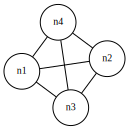
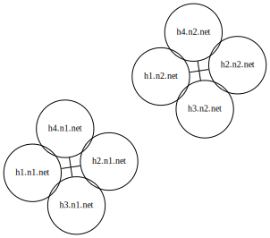
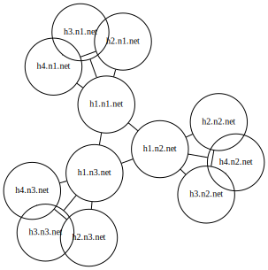

# Examples of wireguard topology's usage

## One single network

the (1-network/)[1-network/] example shows a simple case with 4 hosts in a single mesh

## two distinct networks

the (2-distinct-networks/)[2-distinct-networks/] example shows a simple case with 2 distinct non connected networks.

## One network from three sub networks

the (3-networks/)[3-networks/] example shows a unique network made from 3 sub networks connected through gateways.

⚠️ this example is a valid configuration with a funny shape but I didn't test it so it may not produce what you may expect from this kind of situation.

## One network with 3 vxlans

… to be completed …